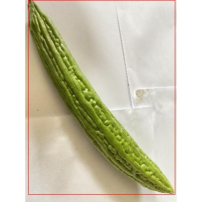
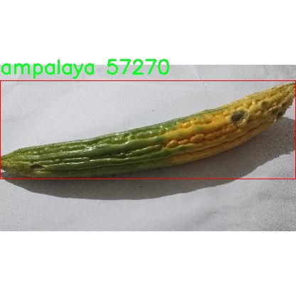

# 苦瓜检测系统源码分享
 # [一条龙教学YOLOV8标注好的数据集一键训练_70+全套改进创新点发刊_Web前端展示]

### 1.研究背景与意义

项目参考[AAAI Association for the Advancement of Artificial Intelligence](https://gitee.com/qunmasj/projects)

项目来源[AACV Association for the Advancement of Computer Vision](https://kdocs.cn/l/cszuIiCKVNis)

研究背景与意义

苦瓜（Ampalaya），作为一种广泛种植的蔬菜，因其独特的苦味和丰富的营养成分而受到人们的青睐。近年来，随着人们对健康饮食的重视，苦瓜的市场需求逐渐增加。然而，苦瓜的种植和收获过程面临着诸多挑战，包括病虫害的影响、气候变化的影响以及人工采摘效率低下等问题。为了提高苦瓜的产量和质量，现代农业亟需借助先进的技术手段进行管理和监测。基于此背景，构建一个高效的苦瓜检测系统显得尤为重要。

在计算机视觉领域，目标检测技术的快速发展为农业智能化提供了新的解决方案。YOLO（You Only Look Once）系列模型以其高效的实时检测能力和良好的准确性，成为目标检测领域的热门选择。YOLOv8作为该系列的最新版本，进一步提升了检测精度和速度，能够在复杂的环境中快速识别目标物体。通过对YOLOv8模型的改进，可以更好地适应苦瓜的生长环境，进而实现对苦瓜的精准检测与监控。

本研究旨在基于改进的YOLOv8模型，构建一个专门针对苦瓜的检测系统。该系统将利用1200张标注图像，针对苦瓜这一单一类别进行训练和优化。通过对图像数据的深度学习，系统能够有效识别苦瓜的生长状态、成熟度以及潜在的病虫害问题。这不仅能够提高苦瓜的种植管理效率，还能为农民提供实时的决策支持，帮助他们及时采取措施，降低损失。

此外，苦瓜检测系统的研究具有重要的社会和经济意义。随着农业生产的智能化转型，基于深度学习的检测技术能够有效提升农业生产的自动化水平，降低人工成本，提高生产效率。通过对苦瓜的实时监测，农民可以更好地掌握作物生长情况，合理安排施肥、灌溉和采摘等管理措施，从而实现增产增收。同时，该系统的推广应用还将推动相关技术的普及，为其他农作物的智能检测提供借鉴和参考。

综上所述，基于改进YOLOv8的苦瓜检测系统不仅具有重要的学术研究价值，也为实际农业生产提供了切实可行的解决方案。通过深入探索这一领域，我们期望能够为农业智能化发展贡献一份力量，推动可持续农业的实现。

### 2.图片演示


##### 注意：由于此博客编辑较早，上面“2.图片演示”和“3.视频演示”展示的系统图片或者视频可能为老版本，新版本在老版本的基础上升级如下：（实际效果以升级的新版本为准）

  （1）适配了YOLOV8的“目标检测”模型和“实例分割”模型，通过加载相应的权重（.pt）文件即可自适应加载模型。

  （2）支持“图片识别”、“视频识别”、“摄像头实时识别”三种识别模式。

  （3）支持“图片识别”、“视频识别”、“摄像头实时识别”三种识别结果保存导出，解决手动导出（容易卡顿出现爆内存）存在的问题，识别完自动保存结果并导出到tempDir中。

  （4）支持Web前端系统中的标题、背景图等自定义修改，后面提供修改教程。

  另外本项目提供训练的数据集和训练教程,暂不提供权重文件（best.pt）,需要您按照教程进行训练后实现图片演示和Web前端界面演示的效果。

### 3.视频演示

[3.1 视频演示](https://www.bilibili.com/video/BV17Q1kYMENR/)

### 4.数据集信息展示

##### 4.1 本项目数据集详细数据（类别数＆类别名）

nc: 1
names: ['ampalaya']


##### 4.2 本项目数据集信息介绍

数据集信息展示

在本研究中，我们使用了名为“Ampalaya”的数据集，旨在改进YOLOv8模型在苦瓜（Ampalaya）检测任务中的表现。该数据集专注于苦瓜这一特定类别，具有单一类别的特征，适合于针对特定物体的检测和识别任务。数据集的类别数量为1，类别列表中仅包含“ampalaya”这一项，这为模型的训练提供了明确的目标，简化了分类过程，同时也提高了模型在特定任务上的精度。

“Ampalaya”数据集的构建过程经过精心设计，确保了数据的多样性和代表性。数据集中包含了多种环境下的苦瓜图像，涵盖了不同的生长阶段、光照条件和背景。这种多样性不仅有助于模型学习到苦瓜的不同特征，还能提高其在实际应用中的鲁棒性。例如，数据集中可能包含在阳光明媚的田野中生长的苦瓜图像，也可能包括在阴暗环境下拍摄的苦瓜，这些都为模型提供了丰富的训练样本。

为了增强模型的泛化能力，数据集还可能包括不同角度和距离拍摄的苦瓜图像。这种多角度的展示方式使得模型能够学习到苦瓜在不同视角下的外观特征，从而在实际应用中能够更准确地识别和定位苦瓜。数据集的图像质量经过严格筛选，确保每张图像都具有足够的清晰度和细节，以便于模型进行有效的特征提取。

在数据预处理阶段，我们对“Ampalaya”数据集进行了必要的标注和整理。每张图像都经过精确的标注，确保苦瓜的边界框准确无误。这一过程对于训练深度学习模型至关重要，因为标注的准确性直接影响到模型的学习效果和最终的检测性能。此外，为了进一步提升模型的性能，数据集还可能采用了数据增强技术，如旋转、缩放、翻转等操作，以增加训练样本的多样性，防止模型过拟合。

在训练过程中，YOLOv8模型将利用“Ampalaya”数据集进行反复迭代学习，通过不断调整参数和优化算法，逐步提高对苦瓜的检测精度。该模型的目标是实现高效、准确的苦瓜检测，能够在实际农业生产中发挥重要作用，帮助农民及时识别和管理苦瓜作物。

总之，“Ampalaya”数据集为本研究提供了坚实的基础，通过精心设计的图像采集和标注过程，确保了数据的高质量和多样性。随着YOLOv8模型的训练和优化，我们期待能够在苦瓜检测领域取得显著的进展，为农业智能化发展贡献一份力量。







### 5.全套项目环境部署视频教程（零基础手把手教学）

[5.1 环境部署教程链接（零基础手把手教学）](https://www.ixigua.com/7404473917358506534?logTag=c807d0cbc21c0ef59de5)


[5.2 安装Python虚拟环境创建和依赖库安装视频教程链接（零基础手把手教学）](https://www.ixigua.com/7404474678003106304?logTag=1f1041108cd1f708b01a)

### 6.手把手YOLOV8训练视频教程（零基础小白有手就能学会）

[6.1 手把手YOLOV8训练视频教程（零基础小白有手就能学会）](https://www.ixigua.com/7404477157818401292?logTag=d31a2dfd1983c9668658)


按照上面的训练视频教程链接加载项目提供的数据集，运行train.py即可开始训练



     Epoch   gpu_mem       box       obj       cls    labels  img_size
     1/200     20.8G   0.01576   0.01955  0.007536        22      1280: 100%|██████████| 849/849 [14:42<00:00,  1.04s/it]
               Class     Images     Labels          P          R     mAP@.5 mAP@.5:.95: 100%|██████████| 213/213 [01:14<00:00,  2.87it/s]
                 all       3395      17314      0.994      0.957      0.0957      0.0843

     Epoch   gpu_mem       box       obj       cls    labels  img_size
     2/200     20.8G   0.01578   0.01923  0.007006        22      1280: 100%|██████████| 849/849 [14:44<00:00,  1.04s/it]
               Class     Images     Labels          P          R     mAP@.5 mAP@.5:.95: 100%|██████████| 213/213 [01:12<00:00,  2.95it/s]
                 all       3395      17314      0.996      0.956      0.0957      0.0845

     Epoch   gpu_mem       box       obj       cls    labels  img_size
     3/200     20.8G   0.01561    0.0191  0.006895        27      1280: 100%|██████████| 849/849 [10:56<00:00,  1.29it/s]
               Class     Images     Labels          P          R     mAP@.5 mAP@.5:.95: 100%|███████   | 187/213 [00:52<00:00,  4.04it/s]
                 all       3395      17314      0.996      0.957      0.0957      0.0845


### 7.70+种全套YOLOV8创新点代码加载调参视频教程（一键加载写好的改进模型的配置文件）

[7.1 70+种全套YOLOV8创新点代码加载调参视频教程（一键加载写好的改进模型的配置文件）](https://www.ixigua.com/7404478314661806627?logTag=29066f8288e3f4eea3a4)

### 8.70+种全套YOLOV8创新点原理讲解（非科班也可以轻松写刊发刊，V10版本正在科研待更新）

#### 由于篇幅限制，每个创新点的具体原理讲解就不一一展开，具体见下列网址中的创新点对应子项目的技术原理博客网址【Blog】：


[8.1 70+种全套YOLOV8创新点原理讲解链接](https://gitee.com/qunmasj/good)

#### 部分改进原理讲解(完整的改进原理见上图和技术博客链接)
### CBAM空间注意力机制
近年来，随着深度学习研究方向的火热，注意力机制也被广泛地应用在图像识别、语音识别和自然语言处理等领域，注意力机制在深度学习任务中发挥着举足轻重的作用。注意力机制借鉴于人类的视觉系统，例如，人眼在看到一幅画面时，会倾向于关注画面中的重要信息，而忽略其他可见的信息。深度学习中的注意力机制和人类视觉的注意力机制相似，通过扫描全局数据，从大量数据中选择出需要重点关注的、对当前任务更为重要的信息，然后对这部分信息分配更多的注意力资源，从这些信息中获取更多所需要的细节信息，而抑制其他无用的信息。而在深度学习中，则具体表现为给感兴趣的区域更高的权重，经过网络的学习和调整，得到最优的权重分配，形成网络模型的注意力，使网络拥有更强的学习能力，加快网络的收敛速度。
注意力机制通常可分为软注意力机制和硬注意力机制[4-5]。软注意力机制在选择信息时，不是从输入的信息中只选择1个，而会用到所有输入信息，只是各个信息对应的权重分配不同，然后输入网络模型进行计算;硬注意力机制则是从输入的信息中随机选取一个或者选择概率最高的信息，但是这一步骤通常是不可微的，导致硬注意力机制更难训练。因此，软注意力机制应用更为广泛，按照原理可将软注意力机制划分为:通道注意力机制（channel attention)、空间注意力机制(spatial attention）和混合域注意力机制(mixed attention)。
通道注意力机制的本质建立各个特征通道之间的重要程度，对感兴趣的通道进行重点关注，弱化不感兴趣的通道的作用;空间注意力的本质则是建模了整个空间信息的重要程度，然后对空间内感兴趣的区域进行重点关注，弱化其余非感兴趣区域的作用;混合注意力同时运用了通道注意力和空间注意力，两部分先后进行或并行，形成对通道特征和空间特征同时关注的注意力模型。

卷积层注意力模块(Convolutional Block Attention Module，CBAM）是比较常用的混合注意力模块，其先后集中了通道注意力模块和空间注意力模块，网络中加入该模块能有效提高网络性能，减少网络模型的计算量，模块结构如图所示。输入特征图首先经过分支的通道注意力模块，然后和主干的原特征图融合，得到具有通道注意力的特征图，接着经过分支的空间注意力模块，在和主干的特征图融合后，得到同时具有通道特征注意力和空间特征注意力的特征图。CBAM模块不改变输入特征图的大小，因此该模块是一个“即插即用”的模块，可以插入网络的任何位置。

通道注意力模块的结构示意图如图所示，通道注意力模块分支并行地对输入的特征图进行最大池化操作和平均池化操作，然后利用多层感知机对结果进行变换，得到应用于两个通道的变换结果，最后经过sigmoid激活函数将变换结果融合，得到具有通道注意力的通道特征图。

空间注意力模块示意图如图所示，将通道注意力模块输出的特征图作为该模块的输入特征图，首先对输入特征图进行基于通道的最大池化操作和平均池化操作，将两部分得到的结果拼接起来，然后通过卷积得到降为Ⅰ通道的特征图，最后通过sigmoid激活函数生成具有空间注意力的特征图。


### 9.系统功能展示（检测对象为举例，实际内容以本项目数据集为准）

图9.1.系统支持检测结果表格显示

  图9.2.系统支持置信度和IOU阈值手动调节

  图9.3.系统支持自定义加载权重文件best.pt(需要你通过步骤5中训练获得)

  图9.4.系统支持摄像头实时识别

  图9.5.系统支持图片识别

  图9.6.系统支持视频识别

  图9.7.系统支持识别结果文件自动保存

  图9.8.系统支持Excel导出检测结果数据


### 10.原始YOLOV8算法原理

原始YOLOv8算法原理

YOLOv8作为目标检测领域的最新进展，承载着前几代YOLO模型的设计理念与技术创新，展现出强大的性能与灵活性。其架构的设计围绕着输入层、主干网络、颈部网络和头部网络四个主要组件展开，形成了一个高效的目标检测系统。该模型的输入层负责对图像进行预处理，首先将输入图像缩放至特定尺寸，以满足网络的输入要求。这一过程确保了模型能够处理不同分辨率的图像，同时保持了特征的完整性。

在主干网络中，YOLOv8通过一系列卷积操作对输入图像进行下采样，以提取图像的深层特征。每个卷积层都结合了批归一化和SiLUR激活函数，这不仅加速了训练过程，还提高了模型的非线性表达能力。主干网络的设计借鉴了YOLOv7中的E-ELAN结构，通过C2f块进一步增强特征提取的效果。C2f块的跨层分支连接方式显著改善了模型的梯度流动，使得特征在网络中能够更有效地传播，从而提升了最终的检测精度。

在主干网络的末尾，YOLOv8引入了SPPFl块，该模块利用三个最大池化层来处理多尺度特征，增强了网络对不同尺度目标的适应能力。这一设计使得YOLOv8能够在面对各种尺寸的目标时，依然保持较高的检测精度，尤其是在复杂场景中，能够有效地识别和定位目标。

颈部网络则利用了特征金字塔网络（FPN）和路径聚合网络（PAN）的结合，进一步融合来自不同尺度的特征图信息。这一过程通过多层次的特征融合，使得网络能够综合利用不同层次的特征，从而提升对目标的识别能力。颈部网络的设计不仅提升了特征的表达能力，还为后续的检测头提供了更加丰富的特征信息，确保了检测结果的准确性。

在检测头部分，YOLOv8采用了解耦的检测头设计，这一创新的结构将目标的分类和回归任务分开处理。通过将这两个任务解耦，YOLOv8能够使每个任务更加专注于自身的目标，从而有效地解决了复杂场景下的定位不准和分类错误的问题。这种解耦设计使得模型在处理多目标检测时，能够更清晰地识别每个目标的类别和位置，提高了整体的检测性能。

值得一提的是，YOLOv8采用了Anchor-free目标检测方法，这一方法的核心在于直接预测目标的位置和大小，而不依赖于预先定义的锚点框。传统的目标检测方法通常需要为不同尺度和形状的目标设置锚点框，这一过程既繁琐又容易出错。而YOLOv8的Anchor-free设计通过回归方式，使得网络能够更快地聚焦于目标位置的邻近点，显著提高了预测框与实际边界框的重合度。这一创新不仅简化了模型的设计，也提升了检测的灵活性和准确性。

YOLOv8的整体架构设计旨在实现高效的实时目标检测，其轻量化的模型权重使得其能够在各种嵌入式设备上顺利运行，满足了实际应用中的实时性需求。相较于前几代YOLO模型，YOLOv8在训练时间和检测精度上都有显著提升，这使得其在目标检测领域树立了新的标杆。

通过对YOLOv8算法原理的深入分析，可以看出其在特征提取、特征融合和目标检测等多个方面的创新设计，使得这一模型在复杂的视觉识别任务中表现出色。未来，随着YOLOv8的广泛应用，其在自动化、智能监控、无人驾驶等领域的潜力将不断被挖掘，推动目标检测技术的进一步发展与进步。


### 11.项目核心源码讲解（再也不用担心看不懂代码逻辑）

#### 11.1 70+种YOLOv8算法改进源码大全和调试加载训练教程（非必要）\ultralytics\models\yolo\detect\train.py

以下是经过简化和注释的核心代码部分，保留了YOLO目标检测训练器的主要功能和结构：

```python
# 导入必要的库
from copy import copy
import numpy as np
from ultralytics.data import build_dataloader, build_yolo_dataset
from ultralytics.engine.trainer import BaseTrainer
from ultralytics.models import yolo
from ultralytics.nn.tasks import DetectionModel
from ultralytics.utils import LOGGER, RANK
from ultralytics.utils.torch_utils import de_parallel, torch_distributed_zero_first

class DetectionTrainer(BaseTrainer):
    """
    基于检测模型的训练器类，继承自BaseTrainer。
    """

    def build_dataset(self, img_path, mode='train', batch=None):
        """
        构建YOLO数据集。

        参数:
            img_path (str): 包含图像的文件夹路径。
            mode (str): 模式，可以是'train'或'val'，用于自定义不同的增强方式。
            batch (int, optional): 批量大小，仅用于'rect'模式。默认为None。
        """
        gs = max(int(de_parallel(self.model).stride.max() if self.model else 0), 32)  # 获取模型的最大步幅
        return build_yolo_dataset(self.args, img_path, batch, self.data, mode=mode, rect=mode == 'val', stride=gs)

    def get_dataloader(self, dataset_path, batch_size=16, rank=0, mode='train'):
        """构建并返回数据加载器。"""
        assert mode in ['train', 'val']  # 确保模式有效
        with torch_distributed_zero_first(rank):  # 在分布式环境中初始化数据集
            dataset = self.build_dataset(dataset_path, mode, batch_size)
        shuffle = mode == 'train'  # 训练模式下打乱数据
        workers = self.args.workers if mode == 'train' else self.args.workers * 2  # 设置工作线程数
        return build_dataloader(dataset, batch_size, workers, shuffle, rank)  # 返回数据加载器

    def preprocess_batch(self, batch):
        """对图像批次进行预处理，缩放并转换为浮点数。"""
        batch['img'] = batch['img'].to(self.device, non_blocking=True).float() / 255  # 将图像转换为浮点数并归一化
        return batch

    def set_model_attributes(self):
        """设置模型的属性，包括类别数量和名称。"""
        self.model.nc = self.data['nc']  # 将类别数量附加到模型
        self.model.names = self.data['names']  # 将类别名称附加到模型
        self.model.args = self.args  # 将超参数附加到模型

    def get_model(self, cfg=None, weights=None, verbose=True):
        """返回YOLO检测模型。"""
        model = DetectionModel(cfg, nc=self.data['nc'], verbose=verbose and RANK == -1)  # 创建检测模型
        if weights:
            model.load(weights)  # 加载权重
        return model

    def get_validator(self):
        """返回YOLO模型验证器。"""
        self.loss_names = 'box_loss', 'cls_loss', 'dfl_loss'  # 定义损失名称
        return yolo.detect.DetectionValidator(self.test_loader, save_dir=self.save_dir, args=copy(self.args))

    def plot_training_samples(self, batch, ni):
        """绘制训练样本及其注释。"""
        plot_images(images=batch['img'],
                    batch_idx=batch['batch_idx'],
                    cls=batch['cls'].squeeze(-1),
                    bboxes=batch['bboxes'],
                    paths=batch['im_file'],
                    fname=self.save_dir / f'train_batch{ni}.jpg',
                    on_plot=self.on_plot)

    def plot_metrics(self):
        """绘制来自CSV文件的指标。"""
        plot_results(file=self.csv, on_plot=self.on_plot)  # 保存结果图
```

### 代码核心部分说明：
1. **构建数据集**：`build_dataset`方法负责根据给定的图像路径和模式构建YOLO数据集，支持训练和验证模式。
2. **数据加载器**：`get_dataloader`方法创建数据加载器，处理数据的批量和多线程加载。
3. **预处理**：`preprocess_batch`方法将图像数据转换为浮点数并进行归一化，以便模型可以处理。
4. **模型属性设置**：`set_model_attributes`方法将数据集的类别信息和超参数附加到模型上。
5. **模型获取**：`get_model`方法创建并返回YOLO检测模型，并可选择加载预训练权重。
6. **验证器**：`get_validator`方法返回用于模型验证的验证器。
7. **绘图功能**：`plot_training_samples`和`plot_metrics`方法用于可视化训练样本和训练过程中的指标。

以上代码是YOLO目标检测训练的核心部分，涵盖了数据处理、模型构建和训练过程中的可视化功能。

该文件是一个用于YOLO（You Only Look Once）目标检测模型训练的Python脚本，属于Ultralytics YOLO系列。它扩展了基础训练器类（BaseTrainer），提供了一系列用于构建数据集、获取数据加载器、预处理批次、设置模型属性等功能的方法。代码的结构清晰，注释详细，便于理解。

首先，`DetectionTrainer`类是该文件的核心，继承自`BaseTrainer`。这个类主要负责处理与目标检测相关的训练过程。类的构造函数并未在代码中展示，但可以推测它会接收一些参数，例如模型配置、数据集路径和训练的轮数等。

`build_dataset`方法用于构建YOLO数据集。它接收图像路径、模式（训练或验证）和批次大小作为参数。该方法通过调用`build_yolo_dataset`函数来创建数据集，并根据模型的步幅（stride）来确定图像的缩放。

`get_dataloader`方法则用于构建和返回数据加载器。它确保在分布式训练时只初始化一次数据集，并根据训练或验证模式设置是否打乱数据。这里还考虑了数据加载的工作线程数量。

`preprocess_batch`方法用于对图像批次进行预处理，将图像转换为浮点数并缩放到0到1之间。

`set_model_attributes`方法用于设置模型的属性，包括类别数量和类别名称等。它确保模型与数据集的配置一致。

`get_model`方法返回一个YOLO检测模型实例，支持加载预训练权重。

`get_validator`方法返回一个用于验证YOLO模型的验证器，负责计算损失等指标。

`label_loss_items`方法用于返回带标签的训练损失项字典，方便监控训练过程中的损失变化。

`progress_string`方法返回一个格式化的字符串，显示训练进度，包括当前轮次、GPU内存使用情况、损失值、实例数量和图像大小等信息。

`plot_training_samples`方法用于绘制训练样本及其标注，帮助可视化训练过程中的数据。

最后，`plot_metrics`和`plot_training_labels`方法用于绘制训练过程中的指标和标签，分别从CSV文件和数据集中提取信息并生成可视化结果。

整体来看，该文件为YOLO模型的训练提供了全面的支持，涵盖了数据处理、模型设置、训练监控和结果可视化等多个方面，是进行YOLO目标检测任务的重要组成部分。

#### 11.2 70+种YOLOv8算法改进源码大全和调试加载训练教程（非必要）\ultralytics\models\sam\amg.py

以下是代码中最核心的部分，并附上详细的中文注释：

```python
import torch

def is_box_near_crop_edge(boxes: torch.Tensor,
                          crop_box: List[int],
                          orig_box: List[int],
                          atol: float = 20.0) -> torch.Tensor:
    """判断给定的边界框是否接近裁剪边缘。"""
    # 将裁剪框和原始框转换为张量
    crop_box_torch = torch.as_tensor(crop_box, dtype=torch.float, device=boxes.device)
    orig_box_torch = torch.as_tensor(orig_box, dtype=torch.float, device=boxes.device)
    
    # 将边界框从裁剪空间转换回原始空间
    boxes = uncrop_boxes_xyxy(boxes, crop_box).float()
    
    # 检查边界框是否接近裁剪框的边缘
    near_crop_edge = torch.isclose(boxes, crop_box_torch[None, :], atol=atol, rtol=0)
    # 检查边界框是否接近原始图像的边缘
    near_image_edge = torch.isclose(boxes, orig_box_torch[None, :], atol=atol, rtol=0)
    
    # 只保留接近裁剪边缘而不接近原始图像边缘的框
    near_crop_edge = torch.logical_and(near_crop_edge, ~near_image_edge)
    
    # 返回一个布尔张量，指示哪些边界框接近裁剪边缘
    return torch.any(near_crop_edge, dim=1)

def uncrop_boxes_xyxy(boxes: torch.Tensor, crop_box: List[int]) -> torch.Tensor:
    """将边界框从裁剪空间转换回原始空间。"""
    x0, y0, _, _ = crop_box  # 获取裁剪框的左上角坐标
    offset = torch.tensor([[x0, y0, x0, y0]], device=boxes.device)  # 创建偏移量张量
    
    # 检查 boxes 是否有通道维度
    if len(boxes.shape) == 3:
        offset = offset.unsqueeze(1)  # 如果有通道维度，则扩展偏移量的维度
    
    # 将偏移量加到边界框上，返回未裁剪的边界框
    return boxes + offset

def batched_mask_to_box(masks: torch.Tensor) -> torch.Tensor:
    """
    计算给定掩码的边界框，返回 XYXY 格式的边界框。
    
    对于空掩码，返回 [0,0,0,0]。输入形状为 C1xC2x...xHxW，输出形状为 C1xC2x...x4。
    """
    # 如果掩码为空，返回全零的边界框
    if torch.numel(masks) == 0:
        return torch.zeros(*masks.shape[:-2], 4, device=masks.device)

    # 将掩码形状标准化为 CxHxW
    shape = masks.shape
    h, w = shape[-2:]  # 获取掩码的高度和宽度
    masks = masks.flatten(0, -3) if len(shape) > 2 else masks.unsqueeze(0)  # 扁平化掩码

    # 获取边界框的上下边缘
    in_height, _ = torch.max(masks, dim=-1)
    in_height_coords = in_height * torch.arange(h, device=in_height.device)[None, :]
    bottom_edges, _ = torch.max(in_height_coords, dim=-1)  # 下边缘
    in_height_coords = in_height_coords + h * (~in_height)  # 处理空掩码
    top_edges, _ = torch.min(in_height_coords, dim=-1)  # 上边缘

    # 获取边界框的左右边缘
    in_width, _ = torch.max(masks, dim=-2)
    in_width_coords = in_width * torch.arange(w, device=in_width.device)[None, :]
    right_edges, _ = torch.max(in_width_coords, dim=-1)  # 右边缘
    in_width_coords = in_width_coords + w * (~in_width)  # 处理空掩码
    left_edges, _ = torch.min(in_width_coords, dim=-1)  # 左边缘

    # 如果掩码为空，右边缘会在左边缘的左侧，替换这些边界框为 [0, 0, 0, 0]
    empty_filter = (right_edges < left_edges) | (bottom_edges < top_edges)
    out = torch.stack([left_edges, top_edges, right_edges, bottom_edges], dim=-1)
    out = out * (~empty_filter).unsqueeze(-1)  # 处理空边界框

    # 返回到原始形状
    return out.reshape(*shape[:-2], 4) if len(shape) > 2 else out[0]
```

### 代码核心部分说明：
1. **`is_box_near_crop_edge`**: 该函数用于判断给定的边界框是否接近裁剪边缘。它首先将裁剪框和原始框转换为张量，然后将边界框从裁剪空间转换回原始空间。接着，它检查边界框是否接近裁剪框和原始图像的边缘，并返回一个布尔张量，指示哪些边界框接近裁剪边缘。

2. **`uncrop_boxes_xyxy`**: 该函数将边界框从裁剪空间转换回原始空间。它通过将裁剪框的左上角坐标作为偏移量加到边界框上，返回未裁剪的边界框。

3. **`batched_mask_to_box`**: 该函数计算给定掩码的边界框，返回 XYXY 格式的边界框。它处理空掩码的情况，并计算掩码的上下左右边缘，最终返回边界框。

这个程序文件是一个关于YOLOv8算法的实现，主要用于处理图像中的目标检测和分割任务。文件中包含多个函数，每个函数的功能各不相同，下面对代码进行逐行解释。

首先，文件引入了一些必要的库，包括数学运算库`math`、迭代工具`itertools`、类型提示库`typing`、数值计算库`numpy`和深度学习框架`torch`。这些库为后续的计算和数据处理提供了支持。

`is_box_near_crop_edge`函数用于判断给定的边界框是否接近裁剪边缘。它接收三个参数：待检测的边界框、裁剪框和原始框。通过将这些框转换为张量，并与裁剪框和原始框进行比较，函数返回一个布尔张量，指示哪些边界框接近裁剪边缘。

`batch_iterator`函数用于从输入参数中生成批次数据。它确保所有输入参数的长度相同，并根据指定的批次大小生成数据批次。

`calculate_stability_score`函数计算一组掩膜的稳定性分数。稳定性分数是通过对掩膜进行阈值处理得到的二进制掩膜之间的交并比（IoU）来计算的。

`build_point_grid`函数生成一个二维网格，网格中的点均匀分布在[0,1]x[0,1]的范围内。这个函数在后续的图像处理和目标检测中可能用于生成采样点。

`build_all_layer_point_grids`函数为所有裁剪层生成点网格。它根据每层的缩放比例生成不同大小的点网格。

`generate_crop_boxes`函数生成不同大小的裁剪框。它根据输入图像的尺寸、层数和重叠比例生成一系列裁剪框，并返回这些框的列表和对应的层索引。

`uncrop_boxes_xyxy`、`uncrop_points`和`uncrop_masks`函数用于将裁剪后的边界框、点和掩膜还原到原始图像的坐标系中。这些函数通过添加裁剪框的偏移量来实现这一点。

`remove_small_regions`函数用于移除掩膜中的小区域或孔洞。它使用OpenCV库的连通组件分析功能，返回处理后的掩膜和一个指示是否进行了修改的标志。

`batched_mask_to_box`函数计算掩膜周围的边界框，返回的边界框格式为XYXY。如果掩膜为空，则返回[0,0,0,0]。

整体来看，这个文件提供了一系列用于图像处理和目标检测的工具函数，适用于YOLOv8算法的实现和优化。通过这些函数，用户可以有效地处理图像数据，生成裁剪框，计算稳定性分数，以及将掩膜转换为边界框等。

#### 11.3 ui.py

以下是经过简化并添加详细中文注释的核心代码部分：

```python
import sys
import subprocess

def run_script(script_path):
    """
    使用当前 Python 环境运行指定的脚本。

    Args:
        script_path (str): 要运行的脚本路径

    Returns:
        None
    """
    # 获取当前 Python 解释器的路径
    python_path = sys.executable

    # 构建运行命令，使用 streamlit 运行指定的脚本
    command = f'"{python_path}" -m streamlit run "{script_path}"'

    # 执行命令，并等待其完成
    result = subprocess.run(command, shell=True)
    
    # 检查命令执行结果，如果返回码不为0，则表示出错
    if result.returncode != 0:
        print("脚本运行出错。")

# 主程序入口
if __name__ == "__main__":
    # 指定要运行的脚本路径
    script_path = "web.py"  # 这里可以直接指定脚本名，假设在当前目录下

    # 调用函数运行脚本
    run_script(script_path)
```

### 代码说明：
1. **导入模块**：
   - `sys`：用于获取当前 Python 解释器的路径。
   - `subprocess`：用于执行外部命令。

2. **`run_script` 函数**：
   - 该函数接受一个脚本路径作为参数，并使用当前 Python 环境运行该脚本。
   - 首先获取当前 Python 解释器的路径，然后构建一个命令字符串来运行指定的脚本。
   - 使用 `subprocess.run` 执行命令，并检查返回码以确定脚本是否成功运行。

3. **主程序入口**：
   - 当脚本作为主程序运行时，指定要运行的脚本路径（这里假设为 "web.py"）。
   - 调用 `run_script` 函数来执行该脚本。

这个程序文件的主要功能是使用当前的 Python 环境来运行一个指定的脚本，具体是通过 Streamlit 来启动一个 Web 应用。程序首先导入了必要的模块，包括 `sys`、`os` 和 `subprocess`，以及一个自定义的 `abs_path` 函数，这个函数可能用于获取脚本的绝对路径。

在 `run_script` 函数中，首先获取当前 Python 解释器的路径，这通过 `sys.executable` 实现。接着，构建一个命令字符串，该命令用于运行指定的脚本，这里使用了 Streamlit 的命令格式。然后，使用 `subprocess.run` 方法来执行这个命令。该方法的 `shell=True` 参数允许在 shell 中执行命令。运行完命令后，程序检查返回码，如果返回码不为零，表示脚本运行过程中出现了错误，程序会输出一条错误信息。

在文件的最后部分，使用 `if __name__ == "__main__":` 语句来确保只有在直接运行该文件时才会执行下面的代码。这里指定了要运行的脚本路径为 `web.py`，并调用 `run_script` 函数来执行这个脚本。

总体来说，这个程序的作用是简化了通过 Streamlit 启动 Web 应用的过程，使得用户只需指定脚本路径，程序就会自动处理运行的细节。

#### 11.4 train.py

以下是经过简化和注释的核心代码部分：

```python
import random
import numpy as np
import torch.nn as nn
from ultralytics.data import build_dataloader, build_yolo_dataset
from ultralytics.engine.trainer import BaseTrainer
from ultralytics.models import yolo
from ultralytics.nn.tasks import DetectionModel
from ultralytics.utils import LOGGER, RANK
from ultralytics.utils.torch_utils import de_parallel, torch_distributed_zero_first

class DetectionTrainer(BaseTrainer):
    """
    基于检测模型的训练类，继承自BaseTrainer类。
    """

    def build_dataset(self, img_path, mode="train", batch=None):
        """
        构建YOLO数据集。

        参数:
            img_path (str): 包含图像的文件夹路径。
            mode (str): 模式，可以是'train'或'val'，用户可以为每种模式自定义不同的增强。
            batch (int, optional): 批次大小，适用于'rect'模式。默认为None。
        """
        gs = max(int(de_parallel(self.model).stride.max() if self.model else 0), 32)  # 获取模型的最大步幅
        return build_yolo_dataset(self.args, img_path, batch, self.data, mode=mode, rect=mode == "val", stride=gs)

    def get_dataloader(self, dataset_path, batch_size=16, rank=0, mode="train"):
        """构建并返回数据加载器。"""
        assert mode in ["train", "val"]  # 确保模式有效
        with torch_distributed_zero_first(rank):  # 在分布式训练中仅初始化一次数据集
            dataset = self.build_dataset(dataset_path, mode, batch_size)
        shuffle = mode == "train"  # 训练模式下打乱数据
        workers = self.args.workers if mode == "train" else self.args.workers * 2  # 设置工作线程数
        return build_dataloader(dataset, batch_size, workers, shuffle, rank)  # 返回数据加载器

    def preprocess_batch(self, batch):
        """对图像批次进行预处理，包括缩放和转换为浮点数。"""
        batch["img"] = batch["img"].to(self.device, non_blocking=True).float() / 255  # 转换为浮点数并归一化
        if self.args.multi_scale:  # 如果启用多尺度
            imgs = batch["img"]
            sz = (
                random.randrange(self.args.imgsz * 0.5, self.args.imgsz * 1.5 + self.stride)
                // self.stride
                * self.stride
            )  # 随机选择尺寸
            sf = sz / max(imgs.shape[2:])  # 计算缩放因子
            if sf != 1:
                ns = [
                    math.ceil(x * sf / self.stride) * self.stride for x in imgs.shape[2:]
                ]  # 计算新的形状
                imgs = nn.functional.interpolate(imgs, size=ns, mode="bilinear", align_corners=False)  # 进行插值
            batch["img"] = imgs  # 更新批次图像
        return batch

    def get_model(self, cfg=None, weights=None, verbose=True):
        """返回YOLO检测模型。"""
        model = DetectionModel(cfg, nc=self.data["nc"], verbose=verbose and RANK == -1)  # 创建检测模型
        if weights:
            model.load(weights)  # 加载权重
        return model

    def plot_training_samples(self, batch, ni):
        """绘制带有注释的训练样本。"""
        plot_images(
            images=batch["img"],
            batch_idx=batch["batch_idx"],
            cls=batch["cls"].squeeze(-1),
            bboxes=batch["bboxes"],
            paths=batch["im_file"],
            fname=self.save_dir / f"train_batch{ni}.jpg",
            on_plot=self.on_plot,
        )
```

### 代码注释说明：
1. **导入模块**：导入所需的库和模块，包括PyTorch、NumPy和Ultralytics的相关功能。
2. **DetectionTrainer类**：定义一个用于YOLO模型训练的类，继承自BaseTrainer。
3. **build_dataset方法**：构建YOLO数据集，接受图像路径、模式和批次大小作为参数。
4. **get_dataloader方法**：创建并返回数据加载器，确保在分布式训练中只初始化一次数据集。
5. **preprocess_batch方法**：对图像批次进行预处理，包括归一化和多尺度调整。
6. **get_model方法**：返回一个YOLO检测模型，可以选择加载预训练权重。
7. **plot_training_samples方法**：绘制训练样本及其注释，便于可视化训练过程。

这些核心部分和注释为理解YOLO模型的训练过程提供了基础。

这个程序文件 `train.py` 是一个用于训练 YOLO（You Only Look Once）目标检测模型的实现，基于 Ultralytics 的 YOLO 框架。程序中定义了一个名为 `DetectionTrainer` 的类，继承自 `BaseTrainer`，专门用于处理目标检测任务。

在类的构造中，首先定义了一个 `build_dataset` 方法，用于构建 YOLO 数据集。该方法接收图像路径、模式（训练或验证）和批量大小作为参数，利用 `build_yolo_dataset` 函数生成数据集。数据集的构建会考虑模型的步幅，以确保图像尺寸与模型要求相匹配。

接着，`get_dataloader` 方法用于创建数据加载器，支持分布式训练。它会根据模式选择是否打乱数据，并设置工作线程的数量。该方法确保在分布式环境中，数据集只初始化一次，以提高效率。

`preprocess_batch` 方法负责对输入的图像批次进行预处理，包括将图像缩放到适当的范围并转换为浮点数格式。如果启用了多尺度训练，它还会随机调整图像的大小，以增强模型的鲁棒性。

`set_model_attributes` 方法用于设置模型的属性，包括类别数量和类别名称。这些信息对于模型的训练和评估至关重要。

`get_model` 方法返回一个 YOLO 检测模型实例，可以选择加载预训练权重。`get_validator` 方法则返回一个用于模型验证的验证器，能够计算损失并进行模型评估。

`label_loss_items` 方法用于生成带有标签的损失字典，便于监控训练过程中的损失情况。`progress_string` 方法返回一个格式化的字符串，显示训练进度，包括当前的轮次、GPU 内存使用情况和损失值。

`plot_training_samples` 方法用于绘制训练样本及其标注，便于可视化训练数据的质量。最后，`plot_metrics` 和 `plot_training_labels` 方法分别用于绘制训练过程中的指标和标签，帮助用户分析模型的性能。

总体来说，这个文件提供了一个完整的框架，用于训练 YOLO 模型，涵盖了数据集构建、数据加载、模型设置、训练过程监控和结果可视化等多个方面。

#### 11.5 code\ultralytics\models\yolo\detect\__init__.py

以下是代码中最核心的部分，并附上详细的中文注释：

```python
# 导入所需的模块
from .predict import DetectionPredictor  # 导入检测预测器类，用于进行目标检测的预测
from .train import DetectionTrainer      # 导入检测训练器类，用于训练目标检测模型
from .val import DetectionValidator       # 导入检测验证器类，用于验证目标检测模型的性能

# 定义模块的公开接口，指定可以被外部访问的类
__all__ = "DetectionPredictor", "DetectionTrainer", "DetectionValidator"
```

### 注释说明：
1. **导入模块**：
   - `DetectionPredictor`：负责进行目标检测的预测，通常会使用训练好的模型对新图像进行推理。
   - `DetectionTrainer`：负责训练目标检测模型，通常会处理数据集的加载、模型的训练过程等。
   - `DetectionValidator`：负责验证模型的性能，通常会在训练后对模型进行评估，检查其在验证集上的表现。

2. **`__all__`**：
   - 这个特殊变量定义了模块的公共接口，指定了哪些类可以被外部导入。只有在`__all__`中列出的类，才能通过`from module import *`的方式被导入。这样可以控制模块的可见性，避免不必要的内部实现被外部访问。

这个程序文件是Ultralytics YOLO（一个流行的目标检测模型）中的一个初始化文件，通常命名为`__init__.py`。它的主要作用是将该目录视为一个Python包，并且定义了该包中可以被外部访问的模块。

文件的第一行是一个注释，表明该项目是Ultralytics YOLO，并且使用了AGPL-3.0许可证。这种许可证允许用户自由使用、修改和分发软件，但要求在分发时也必须开放源代码。

接下来的几行代码通过相对导入的方式，从当前包中导入了三个类：`DetectionPredictor`、`DetectionTrainer`和`DetectionValidator`。这些类分别负责目标检测的不同功能：`DetectionPredictor`用于进行目标检测的预测，`DetectionTrainer`用于训练模型，而`DetectionValidator`则用于验证模型的性能。

最后，`__all__`变量被定义为一个元组，包含了上述三个类的名称。这意味着当使用`from package_name import *`语句导入该包时，只会导入这三个类，而不会导入其他未列出的模块或类。这是一种控制包接口的方式，有助于避免命名冲突和提高代码的可读性。

总体来说，这个文件是Ultralytics YOLO目标检测模型的一个重要组成部分，负责组织和导出与目标检测相关的主要功能模块。

#### 11.6 70+种YOLOv8算法改进源码大全和调试加载训练教程（非必要）\ultralytics\models\yolo\__init__.py

以下是经过简化和注释后的核心代码部分：

```python
# 导入Ultralytics YOLO模型的相关功能
from ultralytics.models.yolo import classify, detect, pose, segment

# 从当前模块导入YOLO类
from .model import YOLO

# 定义模块的公开接口，允许外部访问这些功能
__all__ = 'classify', 'segment', 'detect', 'pose', 'YOLO'
```

### 详细注释：

1. **导入YOLO模型功能**：
   ```python
   from ultralytics.models.yolo import classify, detect, pose, segment
   ```
   - 这一行代码从`ultralytics.models.yolo`模块中导入了四个主要功能：
     - `classify`：用于图像分类的功能。
     - `detect`：用于目标检测的功能。
     - `pose`：用于姿态估计的功能。
     - `segment`：用于图像分割的功能。

2. **导入YOLO类**：
   ```python
   from .model import YOLO
   ```
   - 这一行代码从当前模块的`model`文件中导入了`YOLO`类。这个类可能包含YOLO模型的实现和相关方法。

3. **定义模块的公开接口**：
   ```python
   __all__ = 'classify', 'segment', 'detect', 'pose', 'YOLO'
   ```
   - `__all__`是一个特殊变量，用于定义模块的公共接口。它指定了哪些名称可以被`from module import *`语句导入。这里列出了`classify`、`segment`、`detect`、`pose`和`YOLO`，表示这些功能和类是模块的主要组成部分，用户可以直接使用它们。

这个程序文件是Ultralytics YOLO（You Only Look Once）模型的一个初始化文件，文件名为`__init__.py`，它的主要作用是定义该模块的公共接口和导入相关的功能。

首先，文件开头有一行注释，表明这是Ultralytics YOLO项目的一部分，并且该项目遵循AGPL-3.0许可证。这意味着该代码是开源的，用户可以自由使用和修改，但需要遵循相应的许可证条款。

接下来，文件通过`from`语句导入了四个主要功能模块：`classify`（分类）、`detect`（检测）、`pose`（姿态估计）和`segment`（分割）。这些模块分别对应YOLO模型的不同应用场景，允许用户在不同的任务中使用YOLO算法。

此外，文件还从同一目录下的`model`模块中导入了`YOLO`类。这个类可能是YOLO模型的核心实现，负责模型的构建和训练等功能。

最后，`__all__`变量被定义为一个元组，包含了上述导入的所有模块和类的名称。这一做法的目的是为了明确该模块的公共接口，只有在`from module import *`语句中使用时，才会导入这些指定的名称，从而避免不必要的命名冲突和提高代码的可读性。

总的来说，这个`__init__.py`文件的作用是组织和导出YOLO模型相关的功能，使得用户可以方便地使用这些功能进行图像分类、目标检测、姿态估计和图像分割等任务。

### 12.系统整体结构（节选）

### 整体功能和构架概括

该项目是一个基于YOLOv8算法的目标检测和图像处理框架，提供了多种功能模块，包括目标检测、图像分割、姿态估计等。项目的架构分为多个子模块，每个模块负责特定的功能。主要的功能包括模型的训练、预测、验证、数据处理和可视化等。通过这些模块，用户可以方便地进行目标检测任务，并对模型进行训练和评估。

以下是各个文件的功能整理：

| 文件路径                                                                                       | 功能描述                                                                                       |
|----------------------------------------------------------------------------------------------|----------------------------------------------------------------------------------------------|
| `C:\shangjia\code\70+种YOLOv8算法改进源码大全和调试加载训练教程（非必要）\ultralytics\models\yolo\detect\train.py` | 负责YOLO模型的训练过程，包括数据集构建、数据加载、模型设置、训练监控和结果可视化等。                   |
| `C:\shangjia\code\70+种YOLOv8算法改进源码大全和调试加载训练教程（非必要）\ultralytics\models\sam\amg.py`      | 提供图像处理和目标检测的工具函数，包括裁剪框生成、掩膜处理和稳定性分数计算等。                       |
| `C:\shangjia\code\ui.py`                                                                     | 使用Streamlit启动Web应用，简化通过指定脚本路径运行YOLO模型的过程。                              |
| `C:\shangjia\code\train.py`                                                                  | 负责训练YOLO模型的脚本，可能是一个入口文件，包含训练过程的主逻辑。                               |
| `C:\shangjia\code\70+种YOLOv8算法改进源码大全和调试加载训练教程（非必要）\ultralytics\models\yolo\detect\__init__.py` | 初始化YOLO检测模块，导入并组织相关的类和功能，定义公共接口。                                      |
| `C:\shangjia\code\70+种YOLOv8算法改进源码大全和调试加载训练教程（非必要）\ultralytics\models\yolo\__init__.py`  | 初始化YOLO模型模块，导入分类、检测、姿态估计和分割等功能模块，定义公共接口。                        |
| `C:\shangjia\code\70+种YOLOv8算法改进源码大全和调试加载训练教程（非必要）\ultralytics\data\__init__.py`        | 初始化数据处理模块，可能包含数据集加载和预处理相关的功能。                                        |
| `C:\shangjia\code\70+种YOLOv8算法改进源码大全和调试加载训练教程（非必要）\ultralytics\nn\backbone\revcol.py`  | 实现神经网络的骨干网络结构，可能用于特征提取。                                                  |
| `C:\shangjia\code\70+种YOLOv8算法改进源码大全和调试加载训练教程（非必要）\ultralytics\models\rtdetr\predict.py` | 负责RTDETR模型的预测功能，可能与YOLO模型的预测过程相关。                                         |
| `C:\shangjia\code\code\ultralytics\nn\__init__.py`                                          | 初始化神经网络模块，组织和导出与神经网络相关的功能。                                            |
| `C:\shangjia\code\70+种YOLOv8算法改进源码大全和调试加载训练教程（非必要）\ultralytics\utils\callbacks\hub.py`   | 提供与模型训练过程中的回调函数相关的功能，可能用于监控和调整训练过程。                             |
| `C:\shangjia\code\70+种YOLOv8算法改进源码大全和调试加载训练教程（非必要）\ultralytics\nn\modules\__init__.py`  | 初始化神经网络模块中的子模块，组织和导出相关功能。                                              |
| `C:\shangjia\code\code\ultralytics\engine\validator.py`                                     | 实现模型验证功能，负责计算模型的性能指标和损失等。                                               |

这个表格总结了项目中各个文件的主要功能，帮助用户快速了解项目的结构和各个模块的作用。

注意：由于此博客编辑较早，上面“11.项目核心源码讲解（再也不用担心看不懂代码逻辑）”中部分代码可能会优化升级，仅供参考学习，完整“训练源码”、“Web前端界面”和“70+种创新点源码”以“13.完整训练+Web前端界面+70+种创新点源码、数据集获取”的内容为准。

### 13.完整训练+Web前端界面+70+种创新点源码、数据集获取


# [下载链接：https://mbd.pub/o/bread/ZpyWmZZr](https://mbd.pub/o/bread/ZpyWmZZr)